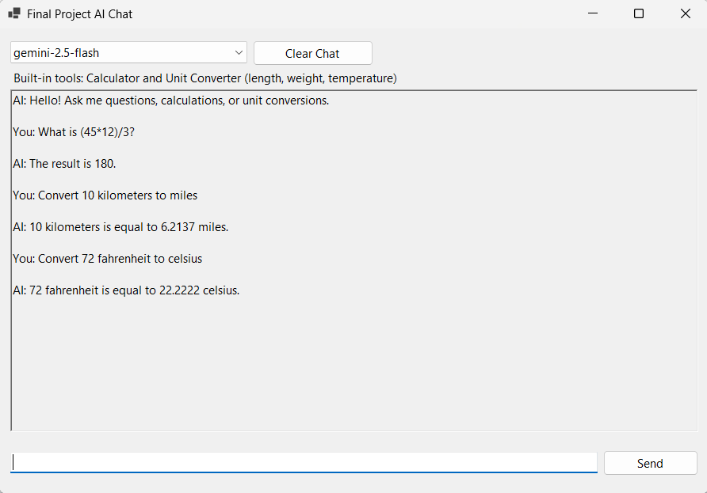

# Final Project

## What the application does

This project is a Windows Forms AI chat application. The user can talk with the AI in a chat window, ask general questions, request calculations, and ask for unit conversions.

## Tools and algorithms used

- Google Gemini model through the `Google.GenAI` SDK
- Streaming-style response rendering in the chat UI
- Calculator tool for arithmetic expressions
- Unit converter tool for length, weight, and temperature conversions
- Short chat memory built from the latest conversation turns

## User guide

1. Create a `.env` file in the repository root or set an environment variable.
2. Add one of these keys:
   - `GEMINI_API_KEY=your_key`
   - `GeminiAPIKey=your_key`
3. Build the project:
   - `dotnet build FinalProject/FinalProject.slnx`
4. Run the WinForms project from Visual Studio on Windows.
5. Choose a model, type a message, and press **Send**.
6. Ask normal questions, math questions, or unit conversion questions such as:
   - `What is (45*12)/3?`
   - `Convert 10 kilometers to miles`
   - `Convert 72 fahrenheit to celsius`

## Screenshot placeholders

