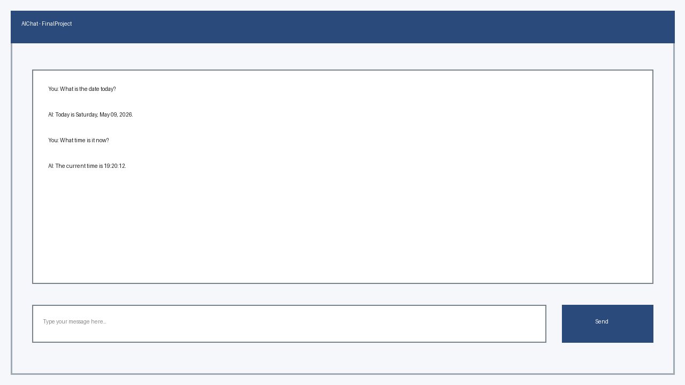

# Final Project Summary

## 1) What the application does
The application is a Windows Forms AI chat client. The user writes messages, gets streamed AI responses, keeps short conversation memory, and can switch between available models.

## 2) Tools / algorithms / features used
- Conversational memory (last messages are sent as context)
- Streaming response rendering
- Model selection from a dropdown
- Tool calling with two tools:
  - Date/Time tool: `GetDate`, `GetTime`
  - Utility tool: `GetRandomNumber`, `GetGuid`

## 3) User guide (how to run and use)
1. Open `FinalProject/FinalProject.slnx` in Visual Studio.
2. Make sure `GeminiAPIKey` is available as an environment variable or in a `.env` file.
3. Run the project (`F5`).
4. Choose a model in the dropdown.
5. Send chat prompts, for example:
   - `What is the time now?`
   - `Give me a random number`
   - `Create a unique id`
6. Use **Clear Memory** to reset conversation context.

## 4) Screenshots

